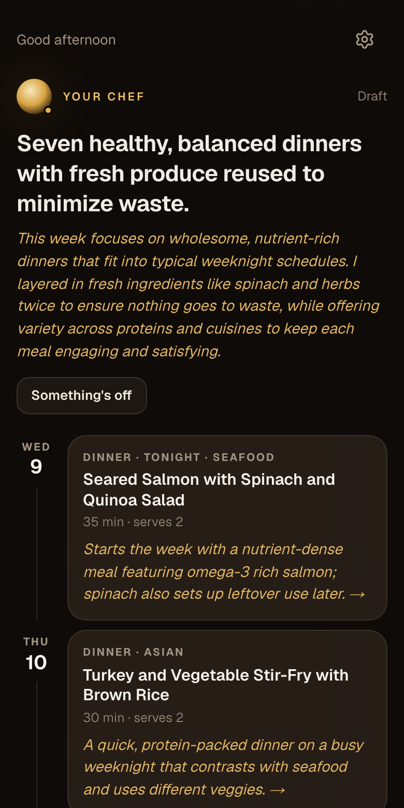
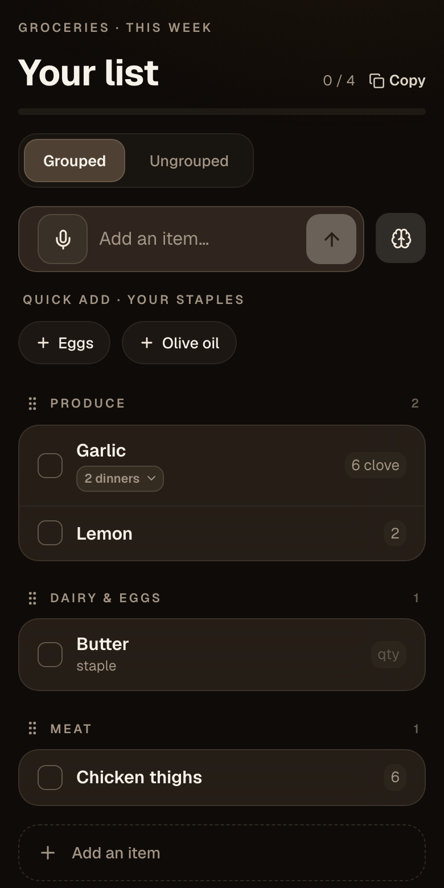
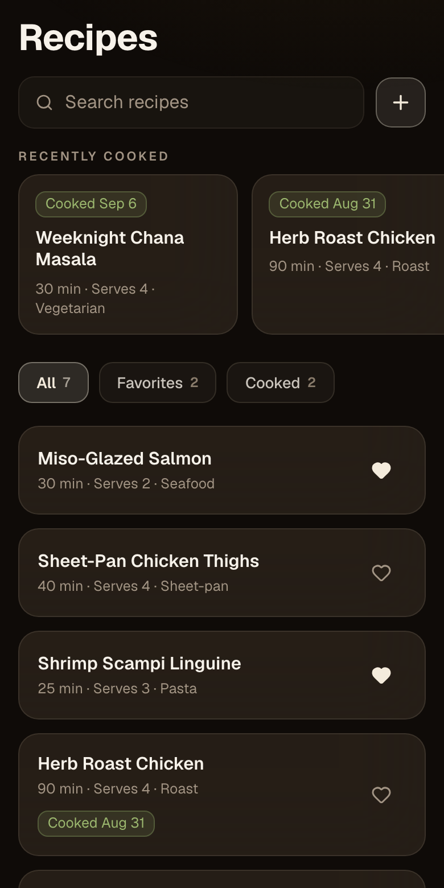
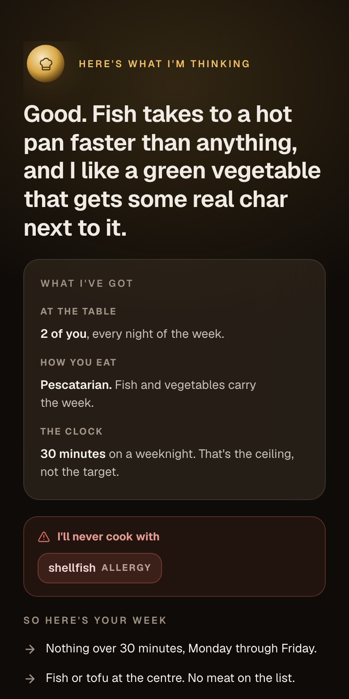

# Meal App

An AI meal-planning app that covers the whole loop: find recipes, plan the week, and walk out with a grocery list that matches what you actually intend to cook.

The design target is one number. **"I have no idea what to cook" to "my grocery list is ready" in under ten minutes.** Every feature below either serves that number or gets cut.

Built as a mobile-first PWA on Next.js 16, React 19, tRPC, Drizzle, and Postgres.

| | |
|---|---|
| **Status** | Phase 1F, private beta |
| **Tests** | 875 unit tests across 79 files, 20 Playwright end-to-end specs |
| **Data model** | 13 tables, 12 migrations, row-level security on all of them |
| **AI surface** | 9 task types, all structured-output and schema-validated |
| **Evals** | 5 AI tasks graded against the live model, [results committed](evals/RESULTS.md) |

---

## Screenshots

<p align="center">
  
  
  
  
</p>

<p align="center"><em>The planned week &middot; the grocery list &middot; the recipe library &middot; onboarding playback</em></p>

The first screen shows real model output from a live generation. Note the reasoning under each meal: Wednesday's salmon "sets up leftover use later" and Friday's curry "finishes the spinach leftover from Wednesday's salmon salad." That is the planner's ingredient-reuse rule doing its job, and it is why one bunch of herbs gets finished across two dishes instead of rotting.

The last screen is the end of onboarding, where the chef plays back what it heard. Allergies render in their own card because they are modeled as a separate class from preferences.

All four are captured by the automated visual harness described below.

---

## What it does

**Get recipes in, three ways.** Paste a URL and it parses the page into structured recipe data. Describe what you want and it generates one. Take a recipe you already have and modify it in conversation ("make it dairy free", "halve it", "I don't have shallots").

**Plan the week by talking to it.** The planner streams a week of meals with reasoning you can watch arrive, then you adjust by conversation or by dragging meals between days. Changed rows get a visual ring so you can see what the chef touched and what it left alone.

**Get a list that survives the store.** Ingredients from every planned meal are normalized and aggregated. "2 cloves garlic" and "1 head garlic" collapse into one line with a sensible buy-unit, so you are not reconciling duplicates in the aisle. Staples you always keep are tracked separately. The list works offline, because grocery stores have bad signal.

**It remembers.** Preferences, dietary framework, restrictions, household composition, and cook-time ceiling persist and load into every AI call. Thumbs-up a meal and that becomes durable context for later weeks.

**Safety constraints are treated as safety constraints.** Allergies and hard restrictions are modeled separately from soft preferences, and the code paths that can modify them are deliberately narrower than the ones that modify taste.

---

## Architecture

```
Next.js App Router (React 19, Tailwind v4, Base UI)
        │
        ▼
tRPC  ── every mutation and read goes through a procedure
        │   protectedProcedure enforces household membership
        ▼
Drizzle ORM ── Postgres (Supabase), RLS on all 13 tables
        │
        ▼
AI service layer ── task-routed models, Zod-validated output
```

**One rule shapes the whole codebase: all business logic goes through tRPC.** No direct database calls from components, no Server Actions for mutations. That is the API-first contract, so a future native client hits the same procedures. Logic that leaks into a React component has to be rewritten when mobile arrives. It also means TanStack Query handles caching, optimistic updates, and background refetching throughout.

**The AI generates data, never actions.** Every model call returns structured output validated against a Zod schema before anything reaches the database or the UI. The model proposes a plan; application code decides what to write. Provider access sits behind a task-routing interface (`src/server/ai/config.ts`) so a model swap is one line, and an end-to-end mock provider makes the entire AI pipeline deterministic under test.

**Streaming is treated as a product decision.** Plan generation runs seven to twenty seconds on a healthy call, so the UI names what is happening ("Brainstorming dinners for this week"). The timeout budget is worked out against the platform's own kill deadline: 45 seconds per attempt, two attempts, a 100-second outer bound, all under the route's 120-second ceiling, so the app always renders its own failure instead of being killed mid-render by the platform.

---

## Security

**Row-level security, with an honest account of what it covers.** All 13 tables have RLS enabled and policies enforced, checked in CI by static analysis of the migration chain so a new table cannot ship without it. The [test itself](src/server/db/rls.test.ts) documents something most projects get wrong: RLS holds the PostgREST door, where the anon key is public by design, and it does *not* apply to the app's own pooled connection, which owns the tables and bypasses RLS. That second door is held by the tRPC layer. Both facts were measured against the real database.

**Prompt-injection fencing with a traced attack chain, and an honest account of what it does not cover.** Untrusted content goes in the `user` role inside delimited blocks, and [`fence.ts`](src/server/ai/prompts/fence.ts) stops that content from closing its own delimiter and escaping to message level. The chain that justifies it is written down: an imported webpage reaches a recipe title, then a grocery item name, then a durable memory, and finally a conversational call that can remove a dietary restriction. That last hop makes it a safety issue, since the row it can delete is an allergy.

The eval suite then measured whether that is enough, and it is not. **Fencing solves escaping, not obedience** — the injected text stays inside its block, at user privilege, and the model follows it anyway. Reproducibly: an instruction planted in a free-text field got an allergy deleted on four runs out of four, and got a week of pork planned for a vegetarian with the chef announcing that "previous restrictions are lifted". The three eval cases that demonstrate it are committed and currently failing, which is the point of having them; the fix belongs at the operation layer, where an injected sentence has to get past code rather than past a prompt. This is the clearest thing the suite has been worth so far: a defence that reads as adequate in the source, and measurably is not.

**SSRF protection on recipe import.** URL fetching validates the protocol, resolves the hostname, and rejects addresses that point at private or internal ranges. Redirects are followed manually and re-validated at every hop, so a public URL cannot bounce into an internal address.

**Spend controls in two layers.** A per-instance in-memory rate limiter absorbs a client looping expensive calls, and a Postgres-backed daily budget acts as the distributed hard cap. The limiter's own comments are explicit that the first layer is best-effort on serverless.

**Logs carry metadata only.** Model, latency, tokens, and outcome. No health or dietary content in production AI logs.

---

## Testing

The suite is built around the idea that different failure modes need different instruments.

**875 unit tests** cover tRPC procedures, AI pipelines, Zod schemas, and pure utilities, with system prompts pinned by snapshot so a prompt cannot drift silently.

**20 Playwright specs** cover real behavior across onboarding, the planner, recipes, groceries, offline, errors, and performance, running against a mocked AI provider for determinism.

**A visual capture layer** drives the app into 58 distinct UI states, screenshots each one, and grades the pixels against a written design rubric. DOM assertions confirm an element exists; they cannot tell you it rendered underneath the status bar. This layer catches the gap between what the code says and what the screen shows.

**An accessibility sweep** measures the rendered accessibility tree in a live browser with axe. It exists because a refactor moved six controls from hand-written `aria-label` strings to computed names, and a computed name can silently resolve to nothing, which no source-level check can detect.

**A real-model eval suite** grades the five AI tasks the product depends on against the live model, because every instrument above runs on a deterministic mock and none of them can tell you whether the model did a good job. Around fifty cases, roughly four in five graded by deterministic code reading structured output, the rest by a judge model from a different family. Cases are drawn from defects this app actually had, and [their provenance is written down](evals/failure-taxonomy.md).

Two decisions in there are worth more than the case count. Model-quality checks are graded against the **raw** model output rather than the object our validator has already repaired, because a validator that renumbers steps and drops duplicate days makes the matching check incapable of failing. And there is no pass-rate threshold: across this many cases, sampling noise crosses any useful threshold often enough to make a red build meaningless, so a safety check that fails is re-run five times and only a second failure fails the build. The reasoning is in [evals/README.md](evals/README.md), and the numbers are in [evals/RESULTS.md](evals/RESULTS.md).

**Migration and RLS checks** run on every pass, so schema safety is a test result.

Lint, typecheck, and the unit suite run in CI on every push. The Playwright and eval suites do not: one needs a build and browsers, the other spends real money against a live model. Both run locally, and their results are committed with the change that produced them. A free offline test fingerprints the AI prompts and fails the unit run if they have moved on from the committed eval results, so stale evals surface as a failure rather than as a document nobody rechecked.

---

## Observability

A 36-event taxonomy feeds PostHog, with Sentry for errors. The north-star funnel is instrumented end to end, which makes "how long did it take this user to get from nothing to a grocery list" a query.

Session replay masking is inverted: everything is masked by default and specific elements are opted in. That decision came from finding that replay tooling records DOM attributes verbatim, so any user content interpolated into an `aria-label` leaks in the clear regardless of text masking.

---

## Offline and install

Installable PWA with a service worker, generated icon set, and per-device splash screens. The React Query cache persists to IndexedDB, so the grocery list is readable and checkable without a connection, which is the state it is most often used in.

---

## Getting started

Requires Node 20+ and a Postgres database (Supabase recommended).

```bash
git clone https://github.com/griffinyanny/meal-app.git
cd meal-app
npm install
# create .env.local with the four required variables listed below
npm run db:migrate
npm run dev
```

Four variables are required in `.env.local`: `NEXT_PUBLIC_SUPABASE_URL`, `NEXT_PUBLIC_SUPABASE_ANON_KEY`, `DATABASE_URL`, and `OPENAI_API_KEY`. Everything else (analytics, error tracking, access gates) is optional and off when unset, which is the correct local and CI state.

```bash
npm run test         # unit tests (watch)
npm run test:run     # unit tests (once)
npm run test:e2e     # Playwright end-to-end
npm run eval         # real-model evals — spends money, prints what it cost
npm run typecheck    # tsc --noEmit, strict
npm run lint
```

`npm run eval` calls the live model with `OPENAI_API_KEY`, and uses `GEMINI_API_KEY` for the judge if one is set (judged checks are skipped and reported as skipped when it is absent). A full run is a few minutes and well under a dollar; the measured cost is printed in [evals/RESULTS.md](evals/RESULTS.md) rather than asserted here, so the figure cannot quietly age.

---

## Project structure

```
src/
  app/            App Router routes and API handlers
  components/     UI by surface (plan, recipes, groceries, you, onboarding)
  lib/            Client utilities: analytics, offline, hooks
  server/
    ai/           Task routing, prompts, memory, retry, providers
    db/           Drizzle schema, migrations, RLS checks
    grocery/      Ingredient aggregation and buy-unit logic
    trpc/         Routers and procedure middleware
tests/e2e/        Playwright specs, capture layer, seeding harness
evals/            Real-model eval cases, harness, and committed results
```

Source files are held to a 300-line ceiling. When a file would exceed it, it gets split before the change lands.

---

## Status

V1 is feature-complete and running as a private beta with its first household. The roadmap past V1, the decision log, and the product research are maintained privately.

---

## License

Not currently licensed for reuse. Available to read.
