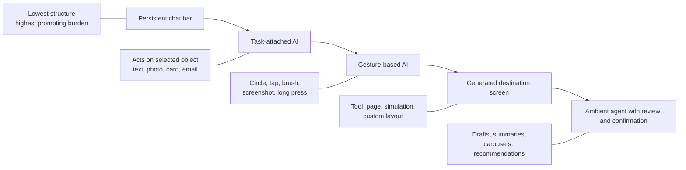
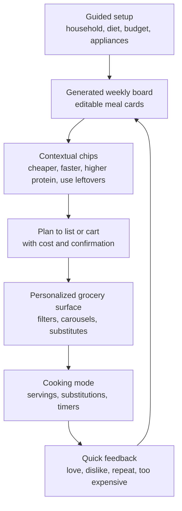

# AI-Native UI Beyond the Chat Bar

## Executive summary

The strongest pattern across 2025–2026 is not “AI as a new chat tab.” It is **AI attached to the object, step, or decision the user is already in**: selected text becomes rewritable in place, a circled item on screen becomes searchable without app switching, a recipe plan becomes a shopping list with one confirmation, a selected image region becomes editable through a contextual bar, and a shopping feed becomes personalized via filters, carousels, and prompts rather than a blank prompt box. Apple’s Writing Tools and Clean Up, Adobe Photoshop’s Generative Fill, Google’s Circle to Search, Instacart’s Smart Shop, Samsung Food’s meal-planning controls, Jow’s structured meal-to-cart flow, Spotify DJ, Granola, Superhuman, Canva Code, Arc Search, and Google Search’s generative UI all point in this direction. citeturn28view1turn31search2turn30view3turn30view1turn34view4turn30view10turn35view1turn30view14turn30view6turn30view7turn36view0turn30view2turn30view0turn29view0

What feels genuinely novel is not merely “AI inside the app,” but four shifts in interaction design. First, **contextual transformation**: the AI acts on a selected object, line, photo region, or recipe card. Second, **gesture-based invocation**: users circle, brush, tap, or screenshot what they mean instead of translating everything into prose. Third, **generated destination screens**: the AI can return a custom page, tool, or simulation rather than another paragraph. Fourth, **ambient and recommendation-led flows**: AI works in the background and surfaces concise drafts, labels, summaries, or carousels at the moment of need. NN/g now distinguishes this as generative UI: the system decides to produce the interface, instead of the user “vibe coding” one into existence. Google Research’s 2025–2026 generative UI work found these custom interfaces were strongly preferred over standard markdown outputs, although expert human-crafted pages still ranked highest. citeturn28view6turn28view7turn29view4turn29view0

What seems gimmicky or fragile is the opposite: **generic sparkle icons, omnipresent floating copilots, and invisible agents without clear confirmations or provenance**. Google’s own UX research found the “AI sparkle” works as a general cue, but ubiquity reduces specificity; by 2024, nearly 100 Google system icons included a sparkle, and use was increasing rapidly. Smashing Magazine argues that legacy loading states like spinners are mismatched to agentic AI because users need process and status visibility, not just waiting indicators. Social discourse on X and Reddit echoes this: designers criticize the “textbox with a sparkle icon,” while community discussions about meal planning and browsers show that users prefer swap-friendly cards, generated lists, and direct controls, but become skeptical when AI feels untrustworthy, hard to steer, or bolted on. citeturn28view3turn28view4turn25search0turn1search20turn19search2turn19search14turn23search8turn19search12

For a **meal-planning or groceries app**, the clearest implication is this: do **not** make the core experience “ask AI what to cook.” Make the core experience a **weekly planning board** with structured inputs, draggable or swipeable meal cards, contextual swap chips, “make cheaper / faster / higher protein / use leftovers” actions, one-tap conversion to a grouped grocery list or cart, and explicit confirmations before substitutions or checkout. In that space, Samsung Food, Jow, and Instacart are the most relevant current references because their AI and recommendation logic already live inside planning boards, item carousels, health tags, and grocery flows instead of a standalone chat pane. citeturn30view10turn30view11turn35view1turn34view4

## Background and scope

I treated the uploaded brief as the governing scope: a professional English report, medium depth, focused on **AI-native UI paradigms beyond the chat bar**, prioritizing shipped consumer products in 2025–2026, explicitly calling out meal-planning and groceries examples, and supplementing official/design sources with X and Reddit discourse. fileciteturn0file0

Because several key details were unspecified, I made the following assumptions. The intended audience is a **general professional product/design audience**, not a specialist HCI lab audience. “AI-native beyond the chat bar” means **the primary value is not delivered through a persistent conversational pane**, even if a product still offers text or voice input as a secondary control. “Consumer apps” includes mass-market mobile and desktop software, plus system apps and creative/productivity tools when they expose reusable interaction patterns. “Meal planning” is interpreted as a **mobile-first consumer experience spanning planning, grocery conversion, and cooking follow-through**. Availability and metrics in this report are current as of **May 25, 2026** and may vary by country or subscription tier. citeturn30view1turn30view14turn33search1turn35view1

A final scope note: there are still relatively few rigorous academic papers specifically about **consumer mobile AI UI taste**. The academic work is stronger at the level of **generative UI as a paradigm**, accessibility, and designer feedback loops, while the freshest evidence about what feels good or annoying in production often comes from official product teams, design writing, App Store/Play listings, and community reactions. That makes this report necessarily mixed-method: official documentation and product launches for the mechanics, design research and HCI papers for conceptual grounding, and X/Reddit as weak-signal evidence of emerging norms and backlash. citeturn29view4turn29view5turn21search15turn28view3turn25search0turn1search20

## Methods and source reliability

I weighted sources in four tiers. **Highest reliability** went to official documentation and launch materials from Apple, Google, Adobe, Canva, Instacart, Spotify, Samsung Food, Jow, Arc, Granola, and Superhuman, because these best describe the actual interaction mechanics and current product availability. **High-to-medium reliability** went to Google Design and Apple HIG/WWDC materials, which are not neutral but do reveal the design intent behind new interaction patterns. **Medium reliability** went to NN/g, Smashing Magazine, and recent academic papers, which are better for pattern interpretation, limitations, and terminology than for product-share claims. **Lowest reliability** went to X posts, Reddit threads, and app-review snippets, which are useful for taste signals and failure modes but are selection-biased and not representative samples. citeturn28view1turn29view0turn30view3turn36view0turn34view4turn30view14turn33search1turn35view1turn28view3turn28view6turn28view7turn29view5turn25search0turn19search2

This source mix matters because official materials often overstate success. I therefore treated product-team metrics like “millions of minutes transcribed,” “16 billion AI uses,” “94 million users,” or “300 million devices” as **good evidence of scale**, but not proof that a pattern is delightful. Conversely, I treated community complaints as **evidence of friction**, but not proof of broad rejection. Where reception data was sparse, I stated that explicitly rather than inferring retention or preference from marketing language alone. citeturn30view6turn36view0turn30view14turn30view1turn23search8turn19search14

## Findings

### The emerging paradigms

The most useful way to read the market is as a shift from **prompt-first interfaces** to **task-first interfaces**. Apple’s Writing Tools appear when text is selected and present transformations such as proofread, summarize, list, or table directly in context; suggestions appear inline and preserve rich formatting. Apple’s Clean Up similarly begins with the photo the user is already editing, highlights likely removable objects, and lets the user tap, brush, or circle distractions. Adobe’s Generative Fill follows the same logic in a more professional tool: first select the exact image region, then use the contextual task bar to alter it. These are all cases where AI is subordinate to the object, not the other way around. citeturn28view1turn31search2turn30view3

Google and Apple are also pushing **gesture-based AI invocation**. Circle to Search lets users long-press, then circle, tap, or gesture on what they want to search, and now lets them dive deeper with AI Mode without switching apps; Google says Circle to Search is available on more than 300 million Android devices. Apple’s newer visual intelligence extends a similar idea to the iPhone screen: users can press the same buttons used for a screenshot to search, summarize, translate, or act on whatever is onscreen. In both cases, the gesture is the prompt. The system infers intent from the current display, which reduces prompt-writing burden and keeps the experience embedded in the user’s current flow. citeturn30view1turn32search0turn32search5

A third pattern is **generated destination screens**. Arc Search’s “Browse for Me” turns a search into a custom webpage written from multiple pages, and Google Search’s AI Mode now dynamically creates visual layouts, interactive tools, and simulations tailored to the query. Google frames this as “generative UI,” and its research says human raters strongly preferred these generated interfaces to standard markdown-based LLM output, even though expert-made pages still won overall. This is a fundamental move away from “answer in a bubble” toward “answer as a temporary product surface.” citeturn30view2turn30view0turn29view0turn29view4

A fourth pattern is **ambient or recommendation-led AI**. Granola is notes-first: it transcribes meeting audio, turns it into structured summaries and action items, and then lets users query that repository with source-linked citations. Superhuman surfaces auto-summaries, instant replies, and idea-to-email generation right inside the inbox. Spotify DJ is neither a chat app nor a playlist prompt box first; it is a listening mode that takes requests and steers playback in real time. Instacart’s Smart Shop personalizes the shopping surface through prompts, health tags, dynamic filters, tailored carousels, and inspiration pages. Jow and Samsung Food treat meal planning as a structured workflow with plans, grocery conversion, saved preferences, and smart suggestions, not a blank conversation. citeturn30view6turn30view7turn30view13turn30view14turn34view4turn35view1turn30view10turn30view11

NN/g’s terminology helps clarify why these feel different. In its 2024 and 2026 pieces, NN/g defines generative UI as an interface dynamically generated in real time for a specific user need and distinguishes it from “vibe coding,” where the human asks for the interface. The practical consequence is important: when the system chooses to materialize a card, chart, simulation, or workflow, the AI is taking on some **design judgment**, not just content production. That raises the bar for constraints, accessibility, trust signals, and editing affordances. Apple’s own ML research aligns with this: designer feedback via commenting, sketching, and direct manipulation produced better UI-generation results than generic ranking-style feedback. citeturn28view6turn28view7turn29view5

The design-writing community is converging on a similar diagnosis. Apple formally added a Generative AI page to the HIG in June 2025, and Apple’s older “Offering help” guidance already favored inline views for simple task help over heavier takeovers. Google Design’s research on the sparkle icon warns that generic AI signifiers lose meaning when overused. Smashing’s recent AI UX writing argues that classic spinner metaphors are poorly matched to agentic systems and that better AI interfaces reveal progress, state, and decision-making. The throughline is that **AI should be discoverable, inspectable, and close to the work**, not floating above it like an omnipresent assistant. citeturn3search6turn2search1turn28view3turn28view4

### A comparison of the most relevant product patterns

| Product | Category | What it does differently from a chat bar | Evidence of shipment / scale / reception | Reliability |
|---|---|---|---|---|
| Apple Writing Tools | System text editing | Appears on text selection; proofread/rewrite/summarize/list/table inline; preserves rich text. | WWDC transcript says suggestions appear “right in line” and invocation comes from the callout/context menu. citeturn28view1 | High |
| Apple Photos Clean Up | Photo editing | User taps, brushes, or circles unwanted objects inside the photo editor; some objects auto-highlight. | Apple support documents the in-editor flow and automatic highlighting. citeturn31search2turn31search16 | High |
| Apple visual intelligence | Systemwide search/action | Uses screenshot buttons or Camera Control to analyze what is onscreen; can summarize, search, or create an event. | Apple announced on-screen access in June 2025 and documents the screenshot-based flow. citeturn32search0turn32search5 | High |
| Google Circle to Search | Search / OS overlay | Circle, tap, or gesture on content without switching apps; follow-up AI Mode lives inside the search flow. | Google says it is on 300M+ Android devices. citeturn30view1 | High |
| Google Search AI Mode | Search | Returns dynamic visual layouts, tools, and simulations tailored to the query. | Official Search and Research posts describe bespoke generative UIs and report strong preference over markdown in user studies. citeturn30view0turn29view0turn29view4 | High |
| Arc Search | Browser | “Browse for Me” creates a custom webpage as the answer rather than a chatbot response. | Arc Help says it reads pages and writes a custom webpage; App Store reviews praise speed but some users find navigation unintuitive. citeturn30view2turn23search8 | High on mechanics, medium on reception |
| Adobe Photoshop Generative Fill | Creative tool | AI is attached to a selected image region and triggered from a contextual task bar. | Adobe docs describe region selection + model picker in the context bar. citeturn30view3 | High |
| Canva Code / AI-Powered Designs | Creative tool | Generates editable designs and interactive widgets inside the canvas; Ask @Canva works from comments. | Canva says AI tools have been used 16B+ times since 2023; 2025 launches added Code, Sheets, Magic Charts, editable AI designs, and contextual @Canva support. citeturn36view0turn36view1turn36view2 | Medium-high |
| Granola | Productivity / notes | Primary surface is the note/transcript; AI appears as structured summary, actions, and cited querying across meetings. | Granola says it transcribes millions of minutes daily and returns source-linked answers. citeturn30view6 | Medium-high |
| Superhuman | Productivity / email | AI drafts, summarizes, reminds, and searches directly inside inbox workflows. | Superhuman says users write emails twice as fast; app listing claims ~4 hours saved per week. citeturn30view7turn23search0 | Medium |
| Spotify DJ | Media / discovery | AI is embedded as a listening mode and request system, not a separate chat product. | Spotify says DJ now takes requests in 60+ markets and has shaped listening for 94M Premium users. citeturn30view13turn30view14 | High |
| Instacart Smart Shop | Grocery | Personalized carousels, filters, prompts, health tags, and inspiration pages replace generic browsing. | Instacart says Smart Shop learns preferences automatically, supports 14 manual preferences, uses 30 Health Tags, and applies them to ~500k products. citeturn34view4turn30view9 | High |
| Samsung Food | Meal planning / groceries | Weekly meal planner with drag/drop planning, long-press recipe actions, and one-tap “Add Plan to Shopping List.” | Samsung says the app has 6M+ users; official site reports 4.8 App Store / 4.6 Google Play ratings and subscription pricing for Food+. citeturn33search4turn33search1turn30view10turn30view11turn22search6turn22search10 | High on mechanics, medium-high on reception |
| Jow | Meal planning / groceries | Structured onboarding around household, appliances, restrictions, goals; personalized weekly menus and grocer-linked cart flow. | Jow says it serves 7M people, creates personalized menus from 5,000+ recipes, and claims time/cost/waste savings; App Store listing shows 4.7 from 1.3K ratings. citeturn35view1turn22search3 | Medium-high |

Two patterns stand out in this table. First, the best experiences **compress the distance between intention and action**. Instead of asking users to describe an outcome from scratch, they expose a nearby object to manipulate: selected text, a recipe tile, a search result, a shopping aisle, a photo region, a mail thread. Second, they return **inspection-friendly structures** such as cards, carousels, generated pages, summaries, and toggles rather than long prose. That is the common thread linking Apple, Adobe, Google, Instacart, Samsung Food, and Jow even though they live in different categories. citeturn28view1turn30view3turn30view1turn34view4turn30view10turn35view1

### What users appear to like and reject

The strongest high-confidence signal is that users like AI when it **reduces a specific step**, not when it asks them to learn a new primary interface. Apple’s system features are good examples because they piggyback on already-familiar gestures: select text, tap reply, edit photo, take screenshot. Google’s gesture-based search and Instacart’s personalized shelves do the same. Canva’s most successful recent AI framing is also not “talk to the bot forever”; it is “generate an editable first draft, then manipulate it in the editor,” or “ask @Canva in a comment where the work already lives.” citeturn28view1turn31search2turn32search5turn34view4turn36view0turn36view1

The strongest high-confidence negative signal is **generic AI chrome**. Google Design’s sparkle study found the icon is recognized, but also that context matters and that ubiquity can reduce effectiveness; the company reported nearly 100 different AI sparkle icons across Google products in 2024 and rising usage. That maps cleanly onto a broader backlash against AI buttons that do not explain what they will do. A representative X post from product designer Jake Batsuuri argues that the “textbox with a sparkle icon” pushes cognitive load back onto the user. That is only a social signal, but it is consistent with the official Google research and with the interaction success of contextual alternatives. citeturn28view3turn25search0

There is also a clear trust requirement. Google’s generative UI work explicitly notes that current generations can take a minute or more and still produce occasional inaccuracies. Smashing’s transparency guidance says classic spinner patterns mismatch agentic uncertainty. Reddit discussions around Arc Search and AI browsers show the same concern in plainer language: users praise convenience when the answer is right, but complain when source-following or navigation becomes confusing, or when hallucinations undermine confidence. The lesson is not “don’t use generated screens”; it is “generated screens must keep links, provenance, editability, and escape hatches visible.” citeturn29view0turn28view4turn23search8turn19search12

The meal-planning discourse is especially consistent. On Reddit, users asking for better meal-planning apps repeatedly praise **weekly generation, easy swaps, automatic grocery lists, and prep-aware workflows**, while criticizing weak pantry support or awkward UX. Samsung Food gets strong public ratings and official recognition, but subreddit comments also show dissatisfaction with pantry intelligence and overall UX for some households. Jow receives positive App Store reviews for linking recipes to grocers and recognizing overlapping ingredients. These are not rigorous market surveys, but as design taste signals they are useful: in food, users want **structured planning + clear shopping outcomes**, not open-ended conversation. citeturn19search2turn19search14turn22search10turn33search1turn22search11turn19search18

### What this means for meal planning and groceries

The meal-planning category is unusually well-suited to post-chat AI because the domain is already **highly structured**. Users usually know their household size, budget, dietary constraints, appliances, prep tolerance, store, and time window. Jow explicitly starts by asking for kitchen appliances, household size, preferences, restrictions, and goals, then generates personalized menus from a recipe pool and routes the result toward grocery shopping. Samsung Food’s planner is similarly board-based, with direct manipulation patterns like long-pressing recipe tiles and one-tap conversion of a plan into a shopping list. Those mechanics are more aligned with how people think about feeding a household than a blank “What should I cook?” text field. citeturn35view1turn30view10turn33search3

Instacart shows what the **grocery side** can add. Smart Shop uses learned preferences, explicit setting controls, real-time prompts such as “Show more low-carb options?,” health tags, dynamic search filters, tailored carousels, and inspiration pages. That means the shopping journey can feel personalized without becoming conversational. For a meal-planning app, the same principle suggests AI should live in chips and cards like “Make this cheaper,” “Use what’s already in pantry,” “Higher protein,” “Kid-friendly swap,” “One-pan alternative,” or “Convert leftovers into lunch,” with the result rendered as updated cards and cart deltas, not as a paragraph. citeturn34view4

A useful design target is therefore not “ChatGPT for dinner,” but an **AI planning board** that keeps the advantages of structured consumer software while borrowing the best affordances from newer AI products. That board should let the user start from a guided setup, see a generated week as editable cards, drag/drop or swipe to swap meals, preview costs and waste, convert the plan to store-specific lists or carts, and receive contextual recommendations at each stage. The assistant can still exist, but as a **secondary fallback** for edge cases, not the primary interface. That matches the direction of food apps, grocery platforms, and the broader AI UI market. citeturn35view1turn30view10turn34view4turn28view7

| Meal-planning stage | Best non-chat pattern | Why it works | Current analogues |
|---|---|---|---|
| Initial setup | Structured onboarding with chips and toggles | Constraints are known in advance; avoids prompt-writing burden. | Jow asks for kitchen, household, restrictions, goals. citeturn35view1 |
| Week creation | Generated meal cards on a calendar/board | Lets users compare a week at a glance and rearrange visually. | Samsung Food meal planner; Jow weekly planning. citeturn30view10turn35view1 |
| Substitution | Contextual chips on each card | “Cheaper / faster / kid-friendly / use leftovers” is easier than freeform prompting. | Instacart real-time prompts; Apple Writing Tools-style task menus. citeturn34view4turn28view1 |
| Grocery conversion | One-tap “plan to list/cart” with confirmation UI | Preserves trust and makes cost visible before commitment. | Samsung Food “Add Plan to Shopping List”; Jow grocer-linked shopping. citeturn30view10turn35view1 |
| Discovery while shopping | Personalized carousels, filters, inspiration pages | Supports browsing and serendipity without losing structure. | Instacart Smart Shop. citeturn34view4 |
| Cooking moment | In-context adjustment controls | Users need serving swaps, timers, substitutions, and missing-ingredient fixes where they cook. | Apple/Adobe object-level interaction is the reusable pattern. citeturn31search2turn30view3 |
| Feedback loop | Lightweight post-meal reactions | Trains future plans without needing explicit prompts. | Spotify DJ request/feedback mindset; Smart Shop preference refinement. citeturn30view13turn34view4 |

## Uncertainties and assumptions

The biggest uncertainty is **reception quality**. Many of these companies publish mechanics and some scale numbers, but few publish careful retention, satisfaction, abandonment, or task-completion data for the specific AI surfaces discussed here. Where I referenced ratings, reviews, Reddit threads, or X posts, those are useful but noisy signals and should not be read as representative population research. citeturn22search3turn22search10turn23search8turn25search0turn19search2

A second uncertainty is **availability and regional rollout**. Apple Intelligence, Google AI Mode, Circle to Search enhancements, Spotify DJ languages, and various beta features have rollout or subscription constraints that may differ by device, country, or tier. This matters for competitive benchmarking because the most novel surfaces are not always globally deployable yet. citeturn30view1turn30view14turn32search3

A third uncertainty is that some products in this report are **hybrid**, not purely post-chat. Canva AI, Spotify DJ, Superhuman Ask AI, and Google AI Mode still accept prompts. I included them because their primary value increasingly appears through generated canvases, contextual comments, embedded summaries, or curated modes rather than through a persistent “assistant pane.” If your standard for “beyond chat” is stricter than that, then Apple Writing Tools, Apple Clean Up, Adobe Generative Fill, Circle to Search, Instacart Smart Shop, Samsung Food, and Jow are the cleanest exemplars. citeturn36view0turn36view1turn30view14turn30view7turn30view0turn28view1turn31search2turn30view3turn30view1turn34view4turn30view10turn35view1

The main assumptions I used were these: the report should favor **shipped, productized experiences** over speculative demos; the most relevant benchmark for a new meal-planning app is **mobile-first household planning plus grocery linkage**; and official product pages have priority over community commentary unless the question is explicitly about trend discourse. Those assumptions match the uploaded brief and the follow-up request to include X/Reddit trend signals. fileciteturn0file0

## Actionable recommendations

The first recommendation is to make the primary product surface a **weekly planning board, not a chatbot**. Use a visible grid or stack of meal cards, each with tiny high-value actions: swap, cheaper, faster, higher protein, use leftovers, kid-friendly, pantry-first, and duplicate later. The evidence from Samsung Food, Jow, and Instacart suggests users are more comfortable when AI changes appear as inspectable structured updates, not as long generated prose. citeturn30view10turn35view1turn34view4

The second recommendation is to **attach AI to the current object**. If the user is on a meal card, the assistant should act on that card. If the user is in the grocery aisle, the assistant should change filters, substitute products, or update carousel groups. If the user is cooking, the assistant should adjust servings or rescue a missing ingredient. Apple, Adobe, and Google’s strongest patterns all work this way: selection first, transformation second. citeturn28view1turn31search2turn30view3turn30view1

The third recommendation is to use **structured inputs before free text**. Ask for household size, number of dinners, budget, store, dietary constraints, prep time, appliances, pantry state, and “must use soon” ingredients through toggles, chips, and small forms. Jow’s onboarding is a direct model here. A secondary “Ask anything” field is still valuable, but the system should not require prose to capture information that can be better expressed as fields. citeturn35view1

The fourth recommendation is to return **generated screens and cards, not explanations**. If the user asks for “a cheaper 5-day high-protein week,” the output should be an updated week with prices, swap badges, and grocery deltas. If the user asks “What can I make from these leftovers?,” the output should be three candidate cards with prep time, missing items, and one-tap add-to-plan actions. Google’s generative UI work is especially instructive here: generated interfaces beat markdown because they turn answers into tools. citeturn29view0turn29view4

The fifth recommendation is to add **provenance and confirmation** everywhere money or preference risk is involved. Show why an item was recommended, whether it matched pantry or dietary intent, what was substituted, and how the new total changed. Instacart’s health tags, preference settings, tailored carousels, and themed inspiration pages are promising because they keep the personalization legible. In food planning, a wrong substitution or invisible logic can destroy trust quickly. citeturn34view4

The sixth recommendation is to avoid the **generic sparkle-button trap**. If you need a global AI entry point, make it secondary. The more important work is to put helpful actions where the user already is: comments, cards, toolbar actions, image selections, list items, or aisle prompts. Google’s own icon research suggests that generic AI iconography loses specificity at scale, and social discourse increasingly mocks undifferentiated “AI buttons.” citeturn28view3turn25search0

The seventh recommendation is to design the loading and review experience as a **visible process**, not a spinner. If the system is generating a week or rebuilding a cart, show intermediate stages such as “checking pantry,” “pricing alternatives,” “reducing waste,” and “adapting for high protein.” Smashing’s AI transparency guidance is especially relevant for agentic shopping and meal-planning flows, where silent waiting feels risky and magical in the wrong way. citeturn28view4

The eighth recommendation is to measure success with **workflow metrics, not model metrics**. The right KPIs are plan completion rate, swap acceptance rate, grocery conversion rate, post-purchase substitution rejection, time-to-week-complete, pantry utilization, waste reduction, repeat-week usage, and the proportion of successful sessions that needed no fallback chat. Those are the metrics that will tell you whether your UI truly moved beyond the chat bar, because the point of the new pattern is not “more AI conversations.” It is **less work to get dinner done**.