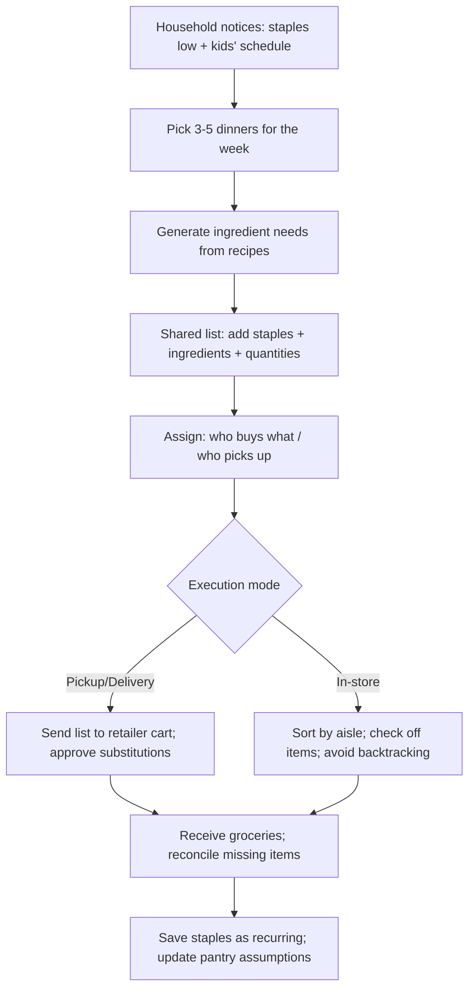
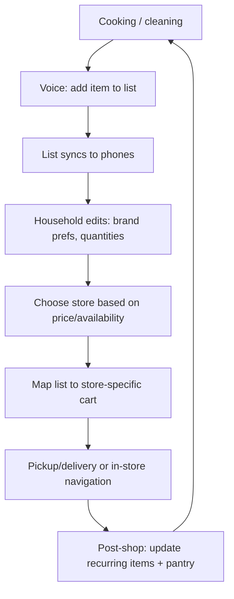

# How People Manage Grocery Lists, Grocery Shopping, and Meal Planning Behaviors

## Executive summary

Grocery list–making is a mainstream behavior, but measured prevalence depends heavily on how “a list” is defined (written vs. mental; “usually” vs. “sometimes”; “before shopping” vs. “during/at the store”). A U.S. survey replication study found that the share of adults agreeing they “usually prepare a shopping list before” grocery shopping declined from 62.7% (2015) to 56.6% (2022). citeturn8view3 Meanwhile, shopper/retailer industry surveys often broaden “list” to include mental lists and report much higher use; one Acosta-based retail report notes “nine in 10” shoppers use a grocery shopping list (paper, mental, or mobile). citeturn11search10

Digital list-making is best understood as a *bundle of behaviors* spread across multiple surfaces (phone notes/reminders, retailer apps, dedicated list apps, voice assistants, and recipe/meal-planning apps). Smartphones are now a near-universal companion on grocery trips in the U.S.: Acosta-reported findings show 89% of grocery shoppers use a smartphone at the store (93% ages 18–39). citeturn11search10 This creates fertile ground for digital lists—but the specific tool chosen is strongly shaped by household coordination needs, device ecosystems, and shopping channel (in-store vs. pickup/delivery).

Evidence suggests “digital” is not automatically “better planning.” A controlled set of studies (paper vs. digital lists) found that digital lists can increase unplanned and more hedonic buying compared with paper lists, while paper lists are associated with higher goal commitment and higher rates of list fulfillment. citeturn22view0turn22view1 This is not an argument against a digital product; it is a design constraint: a successful meal-planning/list app must actively restore planning/commitment benefits that paper naturally provides.

Online ordering is now a meaningful—but not dominant—context for list execution. Nationally representative U.S. government data show that in 2022, 19.3% of grocery shoppers (age 15+) purchased groceries online at least once in the past month; among these online shoppers, pickup (49.1%) and delivery (48.7%) were roughly evenly split, and online shoppers averaged 2.8 online grocery shopping occasions in the prior month. citeturn7view1 These patterns imply many consumers remain omnichannel: lists and meal plans must work for in-store “checking off” *and* for online cart-building.

From a product-validation perspective, the strongest opportunity is not “yet another list,” but a cross-context workflow that: (1) captures intent from recipes/meal plans and household needs, (2) supports household collaboration with low friction, (3) reduces cognitive load in store or online, and (4) translates intent into retailer-specific carts/orders with high match accuracy. Retailers are themselves investing in list tooling (e.g., barcode scan-to-list, handwritten list scanners), signaling that list capture is a competitive lever. citeturn17search21turn17search33turn17search36

## Evidence base and framing

This report synthesizes five evidence streams, prioritized toward primary and official sources:

First, nationally representative and academic research on list use and shopping behavior, including a U.S. survey replication on list attitudes and multivariate profiling of list users. citeturn8view3turn8view1 Second, U.S. government data on online grocery prevalence and demographics from entity["organization","USDA Economic Research Service","us govt research division"] and the American Time Use Survey Eating and Health Module. citeturn7view1 Third, major industry surveys and retail trade reporting (especially Acosta’s shopper survey findings) on smartphone-in-store behaviors, retailer-app usage, and mobile list adoption. citeturn11search10turn11search6 Fourth, platform “hard signals” such as app-store install ranges and official feature documentation for collaboration/voice/list management (e.g., shared lists, cross-device sync). citeturn18view0turn19search4turn21view1turn16search0turn16search3turn16search2 Fifth, qualitative signals from forums/social (not as prevalence proof, but as rich indicators of workflows, edge cases, and switching triggers). citeturn16search25turn6search9turn16search16

Two definitional cautions matter for “validation”:

A “grocery list” can mean (a) an explicit written/digital checklist prepared in advance, or (b) a mental list. Studies that include mental lists will inflate “list usage” compared to studies that ask specifically about preparing a list before shopping. citeturn8view3turn11search10

“Meal planning” spans a wide spectrum: from choosing 2–3 dinners for the week, to full macro/health plans, to simply saving recipes for later. Surveys that only ask about “planning food choices” or “following an eating pattern” are not direct measures of “meal-planning app usage,” but they inform motivations and constraints (price sensitivity, health goals, decision fatigue). citeturn13view0turn14view0

## Methods people use and how common they are

### What “methods” really are: tools plus coordination patterns

In practice, list management methods map to *where they live* (paper, phone, cloud), *who can edit* (solo vs. shared household), and *how they connect* (none, cross-device sync, retailer cart integration, voice capture, recipe import). The market has converged on a handful of dominant “list surfaces”:

Paper and household-visible displays (paper lists, sticky notes, fridge whiteboards): low-tech, high-visibility, high habitability at home.

General-purpose phone tools (notes/reminders): low friction, already installed, easy to adapt, increasingly shareable.

Dedicated grocery list apps: purpose-built features (categories, recurring items, photos, barcode, sorting), usually with real-time sharing.

Voice assistants: capture at the moment of need (“hands full while cooking”), but vulnerable to recognition/ambiguity issues and platform changes.

Retailer apps: strongest connection to availability/price/aisles/coupons and to ordering, but tied to a single retailer ecosystem.

Meal-planning/recipe apps: strongest at “turn recipes into an actionable list,” sometimes with delivery/pickup partner integration.

### Quantitative summary table: prevalence, demographics, pros/cons, typical features

The table below emphasizes *quantitative* prevalence where credible figures exist; where direct prevalence is not well-measured, it reports proxies (e.g., app installs) and clearly labels them.

| Method (surface) | What people do with it | Quantitative prevalence signals (where available) | Demographic patterns supported by evidence | Strengths (why it persists) | Weaknesses / pain points (why people churn) | Typical “table stakes” features |
|---|---|---|---|---|---|---|
| Paper list (incl. pen-and-paper) | Write items, bring to store, cross off | entity["company","Walmart","us retailer"] stated “80% of Walmart customers make a list before coming to the store” (not necessarily paper). citeturn17search33 | Paper tends to be the baseline/default when digital comfort is lower; “digital comfort” is significantly lower among older cohorts in an Acosta-reported generational breakdown. citeturn11search10 | Fast capture, no battery, highly flexible; household “ambient visibility” when placed on counter/fridge | Not shareable in real time; easy to forget; hard to reuse or learn from history | Free-form writing; crossing off; sometimes aisle grouping |
| Fridge whiteboard / home display | Keep a running list visible to household | No robust population prevalence found in primary sources; common enough to appear as a persistent “method class” in consumer discourse and product design targets (see personas/journeys sections). citeturn6search9turn16search25 | More useful when multiple people contribute (families/roommates), and where “visibility” reduces coordination overhead | Always-on, household-shared; reduces “I told you we needed milk” conflicts | Not portable; copy/paste friction to store/online order; versioning issues | Running list; sometimes “pantry staples” section |
| Phone notes / reminders (general-purpose) | Type or dictate items; check off while shopping; share with household | Install-scale proxy: entity["company","Google","tech company"] Keep shows 1B+ Android downloads and explicitly positions itself for grocery lists and sharing. citeturn18view0turn16search11 | Smartphone access varies by demographic; entity["organization","Pew Research Center","us survey research org"] reports detailed smartphone adoption/divides by age/income/education (U.S.). citeturn10search9turn10search1 | Already on device/ecosystem; low adoption friction; cross-device sync | Often “clunky” for shopping-specific flows (categories, duplicates, quantities); collaboration can be awkward across ecosystems | Share/collaborate (e.g., iCloud Reminders lists; Google Keep collaborators). citeturn16search0turn16search1 |
| Dedicated grocery list apps | Maintain shared lists with categories, recurring staples, photos; sometimes recipes | Install-scale proxies (Android): Bring! 10M+ downloads; OurGroceries 1M+; AnyList 1M+; Cozi (family organizer incl. grocery list) 5M+. citeturn19search4turn19search5turn0search0turn19search22 | Skews toward households that need real-time sharing (partners, families, roommates) and toward users willing to adopt a new app for better structure | Real-time sharing; structure (categories/aisles); reusable history; photos for precision | App sprawl; onboarding friction; cross-retailer ordering is often partial; data/privacy concerns for some planners | Multi-list support; item history/autocomplete; sharing; added metadata (quantity, notes, photos) |
| Voice assistants | Add items by voice; retrieve list aloud | Hardware adoption proxy (U.S.): entity["organization","Edison Research","us market research firm"] reports 35% smart speaker ownership among U.S. population 12+ (2025). citeturn10search17 | Ownership and use vary by age/income (e.g., earlier U.S. survey reporting differences by age/income). citeturn10search34 | Hands-free capture during cooking; reduces “I’ll add it later” drop-off | Misrecognition; duplicates; difficulty with quantities/brands; multi-user household permissions; dependence on platform support | Create/find/edit list by voice; list surfaced in companion app. citeturn16search2turn16search3 |
| Retailer apps (store-owned) | Build list/cart; check prices/availability; use coupons; find aisle positions; order pickup/delivery | Acosta-reported surveys: “more than seven in 10 shoppers” use a grocery retailer’s app. citeturn11search6turn11search10 | Younger consumers show higher “digital comfort” and smartphone-in-store usage. citeturn11search10 Online shopping is higher among prime working-age adults and households with children. citeturn7view1 | Best linkage to store inventory, prices, coupons, aisle locations, and ordering | Retailer lock-in; list portability problems across stores; app UX churn | Lists and barcode scan-to-add (examples: Walmart features; Kroger list FAQs; Target list help; Instacart lists). citeturn18view1turn17search1turn17search3turn17search2 |
| Photos as “memory list” | Photograph pantry/fridge/item label; use photo while shopping | No robust population prevalence found; widely supported as a feature in major note/list tools (“photos in notes”) and in dedicated list apps (photos to ensure exact item). citeturn18view0turn19search2turn19search1 | Useful when brand/variant accuracy matters (allergies, specific products), and when multiple shoppers substitute for each other | High fidelity; prevents wrong-item purchases | Hard to search/structure; can become clutter quickly | Attach photos to items; sometimes OCR/image text extraction |
| Recipe & meal-planning apps with list/order integration | Choose recipes → auto-generate grocery list → optionally send to fulfillment partners | Install-scale proxies (Android): Mealime 1M+; eMeals 500K+; Paprika 500K+. citeturn21view1turn21view2turn21view0 | Strong fit for “decision fatigue” and “health goals” segments; food inspiration from social media is common (e.g., 51% of U.S. adults exposed to food/nutrition content said they tried a new recipe). citeturn14view3turn13view0 | Bridges “what to cook” and “what to buy”; reduces planning time and food waste claims | Retail integration coverage is uneven; recipe parsing and ingredient normalization are hard; substitutions create friction | Recipe import; serving scaling; consolidated list; pantry; partner ordering hooks. citeturn21view0turn21view1turn21view2 |

### Contexts where these methods are used

At-home planning is still the dominant “intent formation” stage: people decide what to eat, what is missing, and what constraints apply (budget, health goals, picky eaters). Tools that are *visible in the home* (paper on fridge, whiteboard, shared list) reduce forgetting and reduce coordination cost.

In-store execution increasingly involves mobile augmentation. Acosta-reported findings suggest smartphones have become “indispensable tools” for grocery shopping, with very high usage rates at the store. citeturn11search10 Retailer apps explicitly position “lists + aisle location + scanning” as in-store accelerators. citeturn18view1turn18view2

Online ordering is best viewed as a separate execution mode rather than a replacement for in-store shopping. In nationally representative U.S. data (2022), only about one in five grocery shoppers bought online at least once in the past month, with strong variation by age and household presence of children. citeturn7view1 This implies a “dual-supported list”: one that can be checked off in store, but can also be mapped into an online cart.

## Motivations, pain points, workflows, and switching triggers

### Motivations: why people make lists and meal plans at all

Across academic work, industry surveys, and product positioning, grocery lists function most consistently as (1) an external memory aid, (2) a planning/budgeting tool, and (3) a self-control aid to reduce unplanned purchases.

A classic consumer research panel study found that consumers record only ~40% of the items they ultimately purchase on their lists, underscoring that lists are partial plans rather than full purchase scripts. citeturn12search3

In-store decision-making research shows that unplanned purchasing is structurally common: one field-based model reports a baseline unplanned purchase probability around 0.46, with contextual factors pushing it much higher. citeturn22view2 This makes list-making attractive as a self-regulation strategy: it helps shoppers stay on task amid persuasive store stimuli.

Moving online does not eliminate the list’s self-control role. Experimental work on online grocery shopping found that being induced to make an itemized shopping list reduced the number of items purchased and tended to reduce spending, compared to control conditions. citeturn12search5turn12search9

### Pain points: what breaks in real life

List capture friction appears in three recurring forms:

Latency: “I’ll add it later” causes loss. Voice capture and home-visible surfaces (whiteboards, shared lists) are more robust against latency than single-user phone notes. Amazon’s and Google’s assistant documentation is explicitly built around low-friction voice capture (“add X to my list”). citeturn16search2turn16search3

Ambiguity: “milk” is not a SKU. Retailers respond by allowing flexible terms and then mapping later; Walmart explicitly cited enabling custom terms (e.g., “milk”) as a list-building improvement. citeturn17search33

Coordination: multi-person households struggle with stale copies, duplicate purchases, and “who is shopping today.” Shared list features are now a baseline expectation across ecosystems (Apple Reminders, Google Keep, dedicated list apps). citeturn16search0turn16search1turn19search24turn19search19

Execution pain differs by channel:

In-store, the pain is navigation and speed: finding items, minimizing backtracking, and remembering edge items. Retailer apps emphasize aisle locations and scan-to-add to improve this. citeturn18view1turn17search10

Online, the pain is mapping generic intent to retailer-specific products and dealing with stockouts/substitutions. National survey data show that a major reason non-online shoppers avoid online grocery is preference for seeing/selecting products themselves, especially relevant for perishables. citeturn7view1

### Workflows: the “standard loop” most systems need to support

Despite tool diversity, real-world behavior often follows a stable loop:

Capture → Consolidate → Sort/prioritize → Execute → Reconcile.

Capture: people add items opportunistically—while cooking, noticing missing staples, or seeing recipe inspiration. Social media can be a meaningful trigger for trying new recipes, which then generates ingredient needs. citeturn14view3turn13view0

Consolidate: duplicates get merged; “maybe” items get decided; quantities are guessed. Dedicated list apps and recipe/meal-planning apps often compete here by auto-combining ingredients. citeturn21view1turn21view0

Sort/prioritize: by aisle, by store, by urgency, by budget. This is where paper often performs surprisingly well because people can layout by store path.

Execute: in-store checkoff, or online cart build plus fulfillment selection. Government data show pickup and delivery are both common; apps need to support both. citeturn7view1

Reconcile: move checked items to “purchased,” update pantry mental model, and preserve history for next week.

### Triggers for switching methods (and what they imply)

The strongest switching triggers are *situational changes* and *friction thresholds*, not novelty.

Life stage changes (new child, caregiving demands, health constraints) are repeatedly cited in online-shopping adoption literature as precipitating factors; empirical work during the pandemic also shows rapid shifts to online grocery for many, including first-time online grocery users. citeturn5view2turn7view1

Channel change triggers method change: when people start ordering online, lists become more “plan-like” because the interface itself is list/cart based; experiments show lists can reduce online spending. citeturn12search5turn12search9

Ecosystem-fit triggers switches: iPhone households often gravitate to shared notes/reminders because it is “good enough” and already shared; a representative thread explicitly describes using a shared iPhone note as a dinner menu and then building a grocery list from it. citeturn16search25

Platform policy/product changes can force switching. Google Assistant documentation explicitly notes that notes/lists created using a non-Google list service won’t be available after June 20, 2023, a concrete example of how integrations can break workflows and create churn. citeturn16search3

Retailer feature improvements can also pull consumers into store apps: retailers promote list-building, scanning, and store-mode features, and third-party reporting shows continued innovation like handwritten list scanning to cart. citeturn17search33turn17search36

## Personas and journeys

The personas below are synthesis archetypes grounded in observed patterns from surveys (digital comfort gradients, online grocery adoption by demographics), platform features (sharing, voice, retailer lists), and qualitative signals (shared lists, recipe-to-list behaviors). citeturn11search10turn7view1turn16search0turn16search3turn16search25turn6search9

### The coordinated family planner

Core job-to-be-done: “Feed the household with minimal chaos, minimal waste, and predictable cost.”



Design implications: deep collaboration primitives (real-time sync, roles, conflict-free edits), strong recipe-to-list normalization, and substitution handling.

### The time-starved solo professional

Core job-to-be-done: “Decide dinner fast, shop once, and avoid decision fatigue.”

```mermaid
flowchart TD
  A[End of workday fatigue] --> B[Need 20-30 min meals]
  B --> C[Browse quick recipes or saved rotation]
  C --> D[Auto-build list; de-duplicate with staples]
  D --> E[Optional: schedule delivery/pickup slot]
  E --> F{Shop}
  F -->|Delivery| G[Receive + cook; mark items used]
  F -->|In-store| H[Fast path: aisle order + checkbox]
  G --> I[Keep a "default basket" / reorder pattern]
  H --> I[Keep a "default basket" / reorder pattern]
```

Design implications: speed over completeness, “good enough” ingredient mapping, frictionless onboarding, and strong defaults (rotations, repeat purchases).

### The tech-forward household with voice + automation

Core job-to-be-done: “Capture needs hands-free and keep lists consistent across devices and people.”



Design implications: voice capture as an input channel, robust entity resolution (“milk” → preferred SKU), and resilience to ecosystem changes or integration breakage. citeturn16search3turn16search16

## Feature implications and prioritized product opportunities for a home-cooking app

### Must-have capabilities

A shared, real-time groceries list with low-friction entry is now table stakes because the “default competitors” are not only dedicated list apps but also platform-native shared lists. Apple Reminders allows collaborating on lists and assigning tasks, explicitly referencing grocery items as a use case. citeturn16search4turn16search0 Google Keep supports collaborators and positions itself for shared grocery lists. citeturn16search1turn18view0

To credibly compete, your core must-haves are:

Cross-device, real-time shared lists with offline support and conflict-free syncing.

Fast capture: typing + voice dictation + “add from recipe” + quick-add staples.

List intelligence: de-duplication, canonicalization (tomato vs tomatoes), and quantity/unit handling.

Execution modes: a check-off UI for in-store shopping and a cart-building/export path for online ordering.

History and recurrence: repeated staples, favorites, and “buy it again” behavior patterns, since shopping is cyclical.

### Differentiators that directly address evidence-based friction

Paper-like commitment in a digital product. Because digital lists can correlate with higher unplanned and hedonic purchases in controlled studies, a differentiating product should offer optional “commitment modes”: shopping budgets tied to the list, lock-in of “core items,” and friction to add impulse categories. citeturn22view0turn22view1 This is essentially a design response to the psychological mechanism (goal commitment) identified in the research.

Recipe-to-list normalization that works in real kitchens. Recipe apps already promise this, but users churn when ingredient parsing is noisy (e.g., “1 bunch cilantro” vs “cilantro,” pantry overlap, and substitute flexibility). The most defensible differentiator is a high-quality ingredient graph and household preference model that reduces manual edits.

Cross-retailer portability. Retailer apps provide the best price/inventory/aisle linkage but lock users into one store’s ecosystem. Retailer help docs show each has its own list constructs and entry pathways (e.g., Target lists, Kroger shopping lists, Instacart saved lists). citeturn17search3turn17search1turn17search2 A product opportunity is to be the “source of truth” list and then map/export into retailer-specific carts (where possible) rather than asking users to re-enter items per retailer.

Household coordination tooling beyond “shared list.” Real households need lightweight governance: “assigned shopper,” “do not buy” notes, acceptable substitutes, and allergy constraints. This matters more as households shift between in-store and online ordering, where substitution decisions are unavoidable. citeturn7view1

### High-leverage integrations to prioritize

Retailer/cart pathways: treat pickup and delivery as first-class outputs. Data show both are common among online grocery shoppers; designing only for one will miss half the use cases. citeturn7view1

Retailer app deep links and structured exports: even without full API integration, exports that reduce “search each item manually” can be valuable because retailer UX often drives that pain. citeturn17search18turn17search10

Voice assistant capture as an *input*, not a dependency: leverage voice for capture but avoid fragile third-party list backends that can be deprecated, as evidenced by Google Assistant’s explicit migration note. citeturn16search3

“Bring it into the store” support: aisle sorting and store-mode assistance are an emerging retailer battleground (e.g., Walmart emphasizing aisle locations; third-party reporting on list scanning). citeturn18view1turn17search36

## Recommended research and validation experiments

A strong validation plan should test three linked hypotheses:

The behavior hypothesis: a large share of target users already have a list workflow, and it is painful enough to consider switching.

The value hypothesis: recipe-to-list and list-to-cart reduce time, stress, and missed items.

The channel hypothesis: omnichannel users need one workflow that supports both in-store and online ordering.

### Survey: segmentation + switching willingness

Goal: quantify method mix, pain intensity, and switching triggers.

Sampling: include diverse household structures (single, couples, families, roommates) and a spread of shopping channel behaviors. For U.S. comparability, align some questions with “past 30 days online grocery” framing used in government data. citeturn7view1

Key measures (example questions):

List usage definition: “Before grocery shopping, do you usually prepare a list?” (aligns to academic phrasing). citeturn8view3 Then separately: “Do you ever shop with a *mental* list only?”

Primary list surface: “Which do you use most often? paper / phone notes / reminders / dedicated list app / retailer app / voice assistant / other.”

Collaboration: “Do you share your grocery list with anyone?” “How often do two people add items in the same week?”

Channel mix: “In the past 30 days, did you order groceries online for pickup or delivery?” “How many times?” (alignable to ERS metrics). citeturn7view1

Pain inventory (Likert): forgetting items, duplicate purchases, time in store, online substitutions, list portability across retailers, and recipe-to-list friction.

Switch triggers: “What caused your last switch?” (new baby, moved in with partner, got smart speaker, started ordering online, retailer app change, etc.). Pandemic-era shifts can be benchmarked against published online-grocery adoption results. citeturn5view2

Core survey metrics:

Method prevalence by segment (household type × age band × channel mix).

Top-3 pain points per segment (mean severity and incidence).

Willingness to switch: “If a tool saved you X minutes per week, would you switch?” (conjoint-style).

### Diary study: capture the real workflow and “drop-off points”

Goal: observe capture latency and coordination breakdowns that surveys miss.

Design: 10–14 days, with lightweight prompts:

Every time you add an item: where were you, what triggered it, which tool did you use, and how long did it take?

Shopping event: record total trip time, number of missed items, impulse buys (self-report), and whether list was edited mid-trip.

Online order event: record substitution events and dissatisfaction drivers (freshness concerns are a known barrier). citeturn7view1

Diary success metrics:

Capture latency distribution (minutes between noticing need and recording it).

List-to-cart mapping friction (number of manual edits/searches per item).

Coordination errors (duplicates, stale items, “I didn’t see your update”).

### Prototype tests: prove your “killer workflow”

Prototype A: “Meal plan → list → retailer cart” tested with a clickable prototype plus a concierge back-end that actually builds the cart.

Prototype B: “Shared household list with preferences and substitutions,” focusing on partner collaboration.

Prototype C: “Paper/handwritten or receipt/photo import” if you plan to support migration, aligning with retailer trends toward list scanning. citeturn17search36

Key prototype metrics:

Time-to-first-plan (from empty state to a week plan).

Time-to-complete-list (from selecting recipes to a consolidated grocery list).

List-to-cart match rate (percentage of items mapped to acceptable products without manual correction).

Net “missed items” after a real shop (self-reported + photographed receipts as validation).

Retention intent: “Would you use this next week?” and “What would stop you?”

### Field experiment: measure real-world outcomes vs. “current method”

Run a 4-week within-subject study:

Weeks 1–2: participants use their current method.

Weeks 3–4: participants use your app.

Measure outcomes:

Objective-ish: receipt totals, number of store trips, number of items per trip, online vs in-store mix.

Subjective: stress, decision fatigue, confidence, perceived waste.

Behavioral: unplanned purchases are structurally common; your design should measure whether your tool reduces perceived or self-reported impulses, informed by research linking planning/list use to unplanned purchase reduction. citeturn22view2turn22view0

## Selected source index

entity["organization","USDA Economic Research Service","us govt research division"]: nationally representative estimates of online grocery participation and demographics (2022). citeturn7view1

entity["company","Acosta","cpq sales and marketing firm"] (as reported by trade/press): smartphone-in-store penetration, retailer app usage, and mobile list adoption shares. citeturn11search10turn11search6

entity["organization","Edison Research","us market research firm"]: smart speaker ownership trend (U.S. Infinite Dial 2025). citeturn10search17

entity["organization","Pew Research Center","us survey research org"]: smartphone ownership and digital divide benchmarks (U.S.). citeturn10search9turn10search1

entity["organization","International Food Information Council","us food research nonprofit"]: food purchase drivers and recipe inspiration signals (e.g., social media driving recipe trial). citeturn13view0turn14view3

Academic: paper vs. digital list impacts on planning and impulse buying. citeturn22view0turn22view1

Academic: shopping lists as external memory aids and the partial nature of lists relative to actual baskets. citeturn12search3

Academic: unplanned purchase baseline and the role of shopper activities (including list use) in reducing unplanned purchases. citeturn22view2

Academic: list-making reduces online grocery item counts/spend in experiments. citeturn12search5turn12search9

Platform/retailer official documentation: shared lists and list features (Apple Reminders, Google Keep, Walmart/Kroger/Target/Instacart list tooling). citeturn16search0turn16search1turn18view1turn17search1turn17search3turn17search2